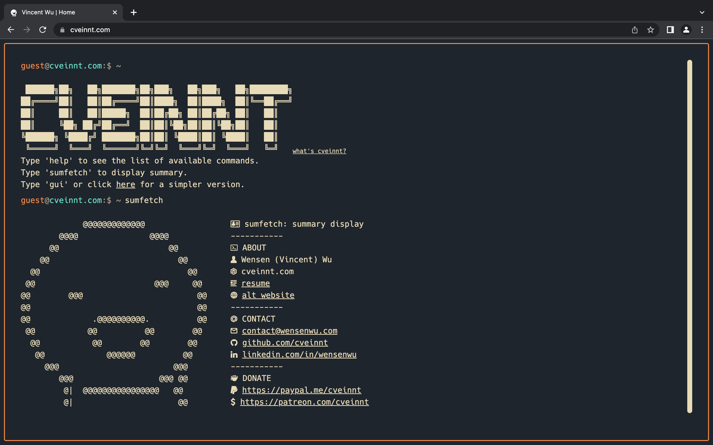

# [LiveTerm - Make terminal styled websites in minutes!](https://liveterm.vercel.app)

Highly customizable, easy-to-use, and minimal terminal styled website template, powered by Next.js.

To build a simple terminal styled website with LiveTerm, you only need to work with one file: `config.json`. After you filled out the config file, simply run `yarn install && yarn dev` to build your website!

LiveTerm can be used to build a variety of websites: a personal website, a project page, a startpage, or just a cool browser music player...you name it!

Source files for LiveTerm are all less than 150 lines of codes in length, with great emphasis towards readability and customizability.

Feel free to play with the web demo!

## Showcase

<p align="center">
<br>
<strong>Default LiveTerm</strong>
</p>

Live version: https://liveterm.vercel.app

<p align="center">
<br>
<strong>my personal website</strong>
</p>

Live version: https://cveinnt.com

## Quick Start

First, clone this repository:

```bash
git clone https://github.com/Cveinnt/LiveTerm.git
```

Then, install dependencies:

```bash
yarn install
```

Now you can start development!

```bash
yarn dev
```

Or, you can build the project:

```bash
yarn build && yarn start
```

## Configuration

### Basic Configuration

Most of the configuration is done through the `config.json` file.

```javascript
{
  "readmeUrl": // create a Github README and link it here!
  "title": // title of the website
  "name": // returned by the command of the same name
  "ascii": // ascii art to display
  "social": {
    "github": // your handle
    "linkedin": // your handle
  },
  "email": // your email
  "ps1_hostname": "liveterm" // hostname in prompt
  "ps1_username": "visitor", // username in prompt
  "resume_url": "~/Resume.pdf", // path to your resume
  "non_terminal_url": "W",
  "colors": {
    "light": {
      ...
    },
    "dark": {
      ... // you can use existing templates in themes.json or use your own!
    }
  }
}
```

Feel free to change it as you see fit!

### Themes

You can find several pre-configured themes in `themes.json`, and you can replace the colors in `config.json` with the theme color you like! The themes are based on the themes on [this website](https://glitchbone.github.io/vscode-base16-term/#/).

<p align="center">
<br>
<strong>different LiveTerm themes</strong>
</p>

For a better preview of the themes, checkout the images in the `demo` folder.

### Favicons

Favicons are located in `public/`, along with other files you may want to upload. I used this [website](https://www.favicon-generator.org/) to generate favicons.

### Banner

You may also want to change the output of `banner` command. To do that, simply paste your generated banner in `src/utils/bin/utils.ts`. I used this [website](https://manytools.org/hacker-tools/ascii-banner/) to generate my banner.

### Advanced Configuration

If you want to further customize your page, feel free to change the source code to your preference!

## Deploy on Vercel

The easiest way to deploy a Next.js app is to use the [Vercel Platform](https://vercel.com/) from the creators of Next.js.

Check out [Next.js deployment documentation](https://nextjs.org/docs/deployment) for more details.

## Credit

Based on M4TT72's awesome [Terminal](https://github.com/m4tt72/terminal).
